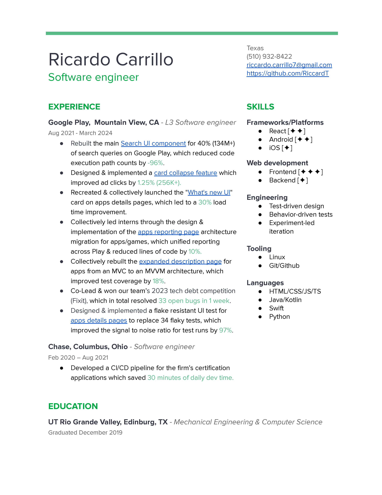

# My Software Engineering Resume

## Context

I have a habit of keeping old resumes around purely for nostalgia. I also find myself needing to update my resume semi-frequently so recruiters can see the latest snapshot of my career. I thought, "What's a tool I could use to both automate version control and present the latest version?". Git, duh! So, voila :)
